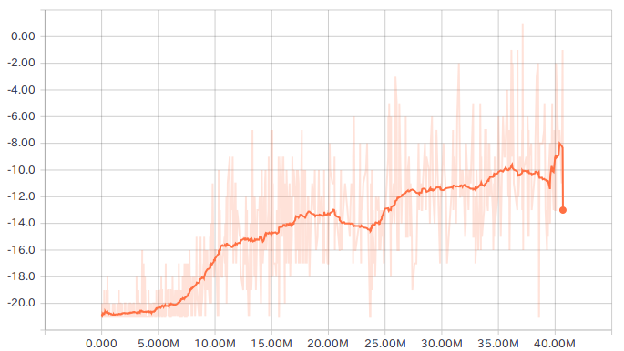
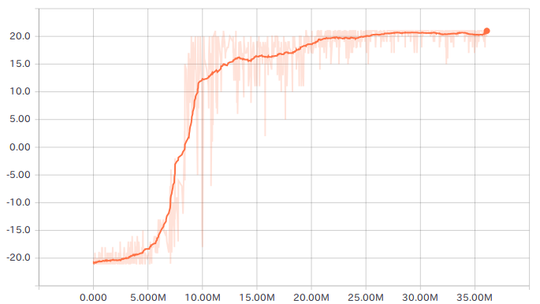

# async_deep_reinforce

Asynchronous deep reinforcement learning

## About

An attempt to repdroduce Google Deep Mind's paper "Asynchronous Methods for Deep Reinforcement Learning."

http://arxiv.org/abs/1602.01783

Asynchronous Advantage Actor-Critic (A3C) method for playing "Atari Pong" is implemented with TensorFlow.
Both A3C-FF and A3C-LSTM are implemented.

Learning result movment after 26 hours (A3C-FF) is like this.

Any advice or suggestion is strongly welcomed in issues thread.

https://github.com/miyosuda/async_deep_reinforce/issues/1

## How to build

First we need to build multi thread ready version of Arcade Learning Enviroment.
I made some modification to it to run it on multi thread enviroment.

    $ git clone https://github.com/miyosuda/Arcade-Learning-Environment.git
    $ cd Arcade-Learning-Environment
    $ cmake -DUSE_SDL=ON -DUSE_RLGLUE=OFF -DBUILD_EXAMPLES=OFF .
    $ make -j 4
	
    $ pip install .

I recommend to install it on VirtualEnv environment.

## How to run

To train,

    $python a3c.py

To display the result with game play,

    $python a3c_disp.py

## Using GPU
To enable gpu, change "USE_GPU" flag in "constants.py".

When running with 8 parallel game environemts, speeds of GPU (GTX980Ti) and CPU(Core i7 6700) were like this.

|type | A3C-FF             |A3C-LSTM          |
|-----|--------------------|------------------|
| GPU | 1722 steps per sec |864 steps per sec |
| CPU | 1077 steps per sec |540 steps per sec |

## Result
Score plots of local threads of pong were like these. (with GTX980Ti)

### A3C-LSTM LOCAL_T_MAX = 5

### A3C-LSTM LOCAL_T_MAX = 20

Scores are not averaged using global network unlike the original paper.

## References

This project uses setting written in muupan's wiki [muuupan/async-rl] (https://github.com/muupan/async-rl/wiki)

## Acknowledgements

- [@aravindsrinivas](https://github.com/aravindsrinivas) for providing information for some of the hyper parameters.

